# わすれもの駅 — Wasuremono Station

だれもいない昼下がりの駅を、小さな案内ロボットが歩く。ブラウザで遊べる 3D 探索ゲーム。

[](https://tanuu5.github.io/wasuremono-station/)
[](https://www.anthropic.com/claude)
[](./LICENSE)
[](#english)

<p align="center">
  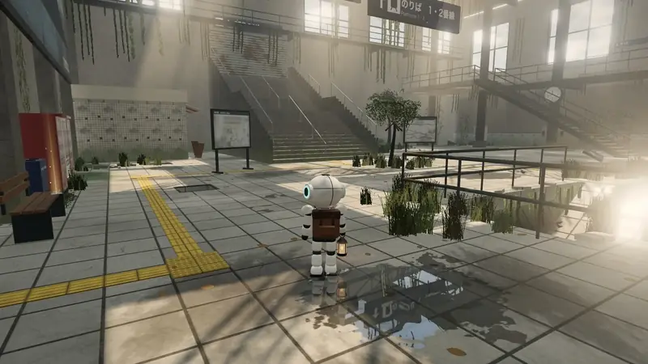
</p>

<p align="center"><b><a href="https://tanuu5.github.io/wasuremono-station/">▶ ブラウザで今すぐ遊ぶ</a></b>（インストール不要。キーボード・ゲームパッド・タッチで遊べます）</p>

**Claude Code × Claude Opus 5.5（MAX）** で作りました。

人のいなくなった月見坂駅。屋根の穴から差しこむ日の光で、忘れ物センターの案内ロボット「トモ」が目をさまします。
駅のどこかに残された 7 つの忘れ物をさがして、持ち主へ届けるのがトモの仕事です。忘れ物を拾うと、それを置いていった人の思い出が、淡い残像になって現れます。
戦いも、こわい場面もありません。つたの垂れるコンコース、暗い地下通路、床のぬけた地下街、草に埋もれたホームを、ゆっくり歩いて調べてまわる、なつかしくて少し不思議なゲームです。

駅の建物、看板やポスター、ロボット、草木、光の筋、効果音や曲まで、ほとんどすべてをコードで作っています（画像のファイルは、カレンダー・落書き・時刻表の 3 枚だけ）。
日本語と英語に対応しています（設定画面で切り替え）。English follows below.

## スクリーンショット

<table>
  <tr>
    <td width="50%">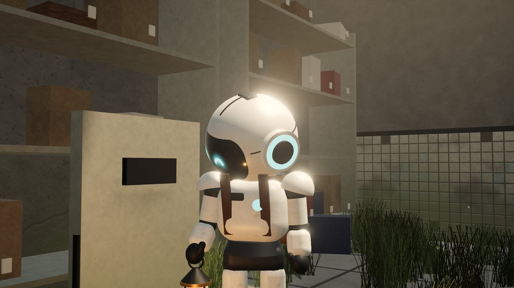<br><sub>主人公は、駅の小さな案内ロボット「トモ」。天井の穴から差しこむ日の光で目をさます。</sub></td>
    <td width="50%">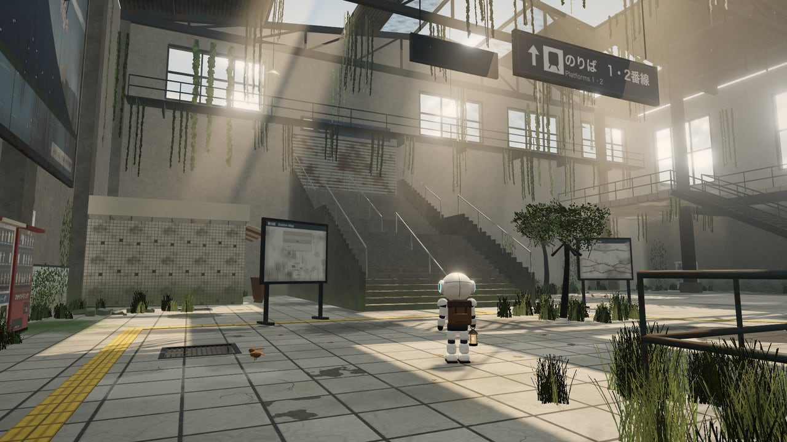<br><sub>だれもいないコンコース。屋根の穴から日の光が差し、つたが垂れ下がる。</sub></td>
  </tr>
  <tr>
    <td>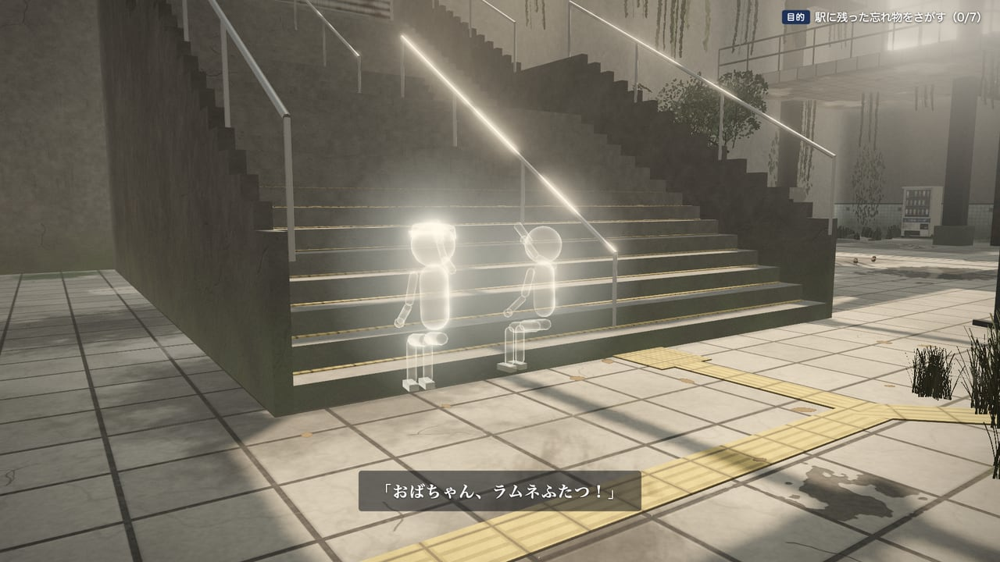<br><sub>忘れ物を拾うと、持ち主の思い出が残像になって現れる。</sub></td>
    <td>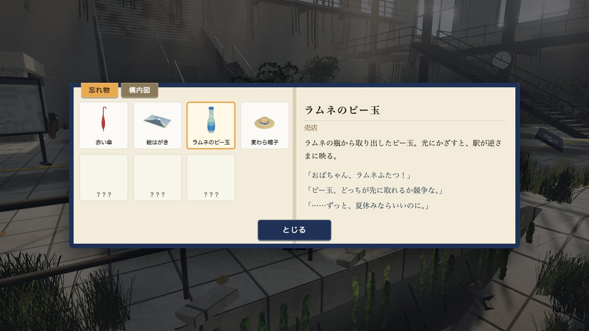<br><sub>見つけた忘れ物と思い出は、手帳に記される。構内図で居場所も確かめられる。</sub></td>
  </tr>
  <tr>
    <td>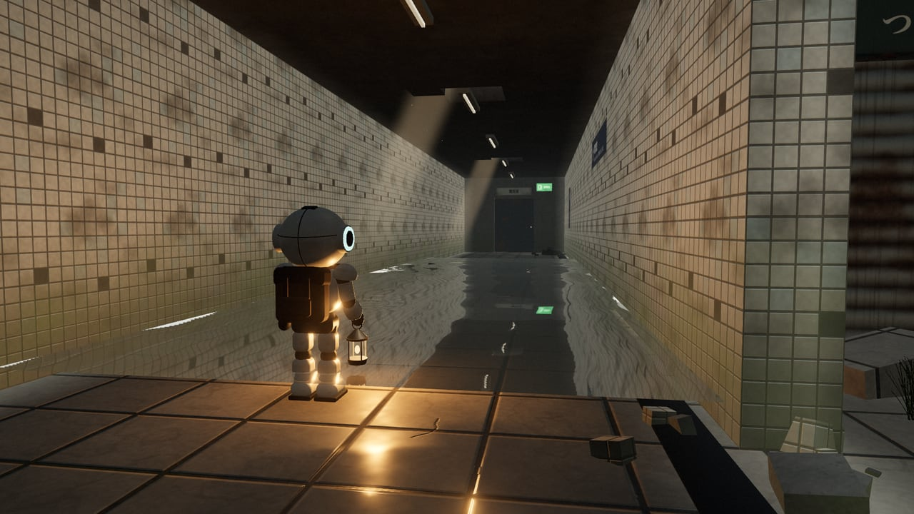<br><sub>暗い地下通路は、ランタンの明かりで。水たまりに光が映りこむ。</sub></td>
    <td>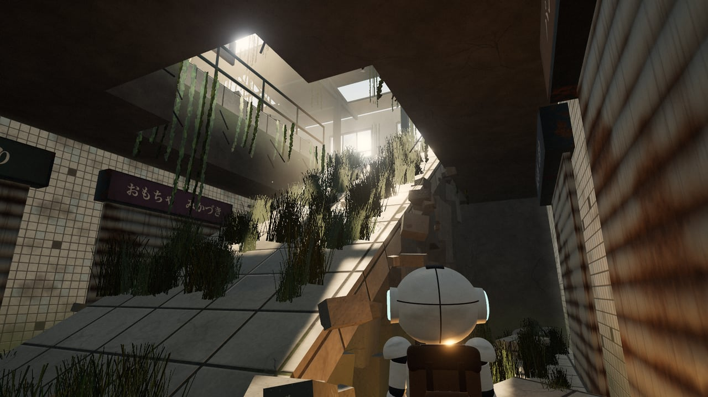<br><sub>床がぬけて坂になった地下街「つきみ横丁」。穴から日の光が落ちる。</sub></td>
  </tr>
  <tr>
    <td>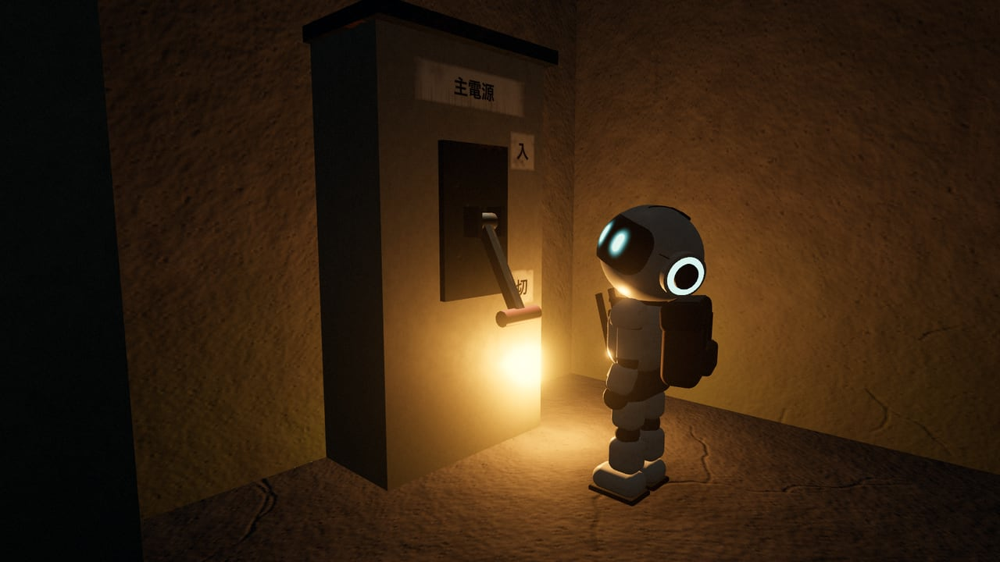<br><sub>電気室の主電源。レバーを引き上げると、駅に明かりがもどる。</sub></td>
    <td>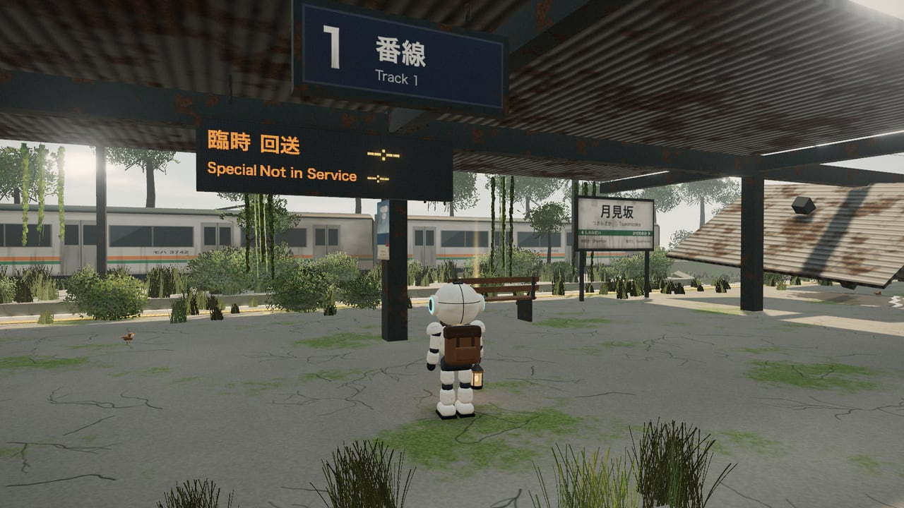<br><sub>草に埋もれたホーム。向こうの線路には、止まったままの電車。</sub></td>
  </tr>
  <tr>
    <td>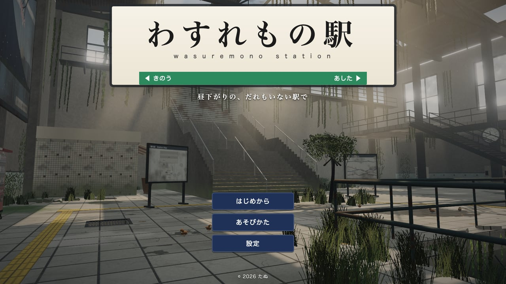<br><sub>タイトルは駅名標。となりの駅は「きのう」と「あした」。</sub></td>
    <td>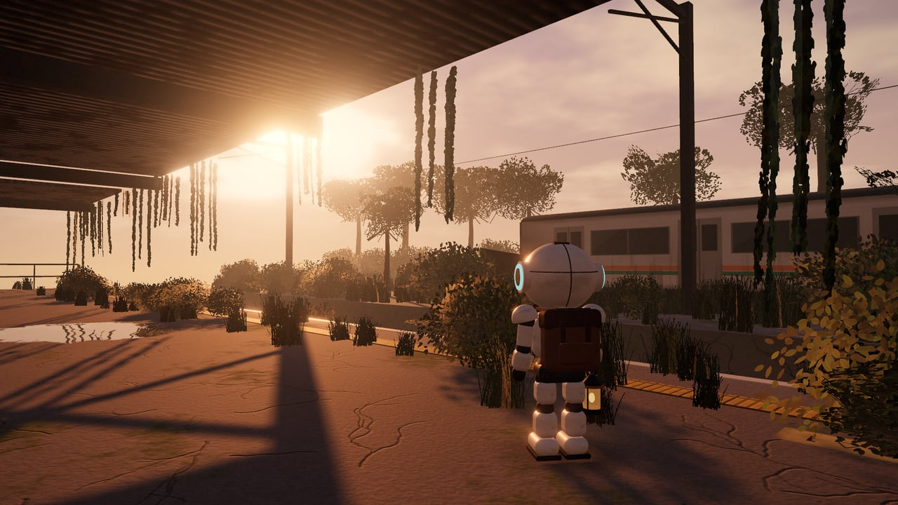<br><sub>時計が動きだしたあとの、夕暮れのホーム。</sub></td>
  </tr>
</table>

画像と動画は、すべて実際のゲーム画面です。

## 遊び方

光っているものや気になるものに近づくと「調べる」が出ます。忘れ物を 7 つ集めたら、ホームの乗車位置へ。行き詰まったら手帳を開くと、まだ見つけていない忘れ物の心当たりと、次に行く場所が分かります。

| 操作 | キーボード・マウス | ゲームパッド | タッチ |
| --- | --- | --- | --- |
| 移動 | W A S D / 矢印キー | 左スティック | 画面の左側をドラッグ |
| 見まわす | マウス（クリックで固定）／ドラッグ | 右スティック | 画面の右側をドラッグ |
| 調べる | E / Enter（近くに何かあれば Space でも） | X / □（A / × でも） | 調べる |
| ジャンプ | Space | A / × | ジャンプ |
| 走る | Shift | B / ○、RB / R1 | スティックをいっぱいに倒す |
| 手帳 | Tab / Q / M | Y / △ | 手帳 |
| 一時停止 | Esc / P | Start | Ⅱ |

- 進み具合はブラウザに自動で保存され、タイトルの「つづきから」で再開できます。
- エンディングのあとに「つづきから」を選ぶと、夕暮れの駅をもう一度歩けます。駅のどこかに、見おぼえのないものが増えています。
- はじめの演出は、Esc・Start・B / ○ で飛ばせます。
- 画質は設定画面で選べます（自動・高・中・低）。重いときは「中」か「低」に。

## 制作について

企画・ディレクション：**たぬ**　／　開発：**Claude Code（Claude Opus 5.5・推論レベル MAX）**

ゲームの設計から、建物・ロボット・草木の 3D モデル、看板やポスターの絵（canvas で描画）、光の筋や水たまりの映り込みのシェーダー、Web Audio で合成した効果音と曲、物語の文章、日本語と英語の文言まで、Claude が作りました。
駅務室のカレンダー、地下の落書き、時刻表のポスターの 3 枚の絵は、たぬが ChatGPT（OpenAI）で作ったものです。Claude が色あせや汚れをかけて、駅になじませています。
見た目は、ヘッドレス Chrome（実 GPU）で場所ごとに撮影して確かめています。進行は、自動で歩かせる仕組みで主な道すじ（バルコニーのジャンプ、売店のシャッターの下、地下通路、つきみ横丁の坂、ホームと線路）を通れるかを確かめ、エンディングまで通して確認しました。

## 更新履歴

- **2026-10-06**：公開

## 開発

```bash
npm install
npm run dev      # 開発サーバー（http://127.0.0.1:5183/）
npm run build    # dist/ に公開用のファイル
```

URL に付けて使えるもの：

| パラメータ | 意味 |
| --- | --- |
| `?quality=high` / `medium` / `low` | 画質を固定する（その回だけ） |
| `?lang=en` | 英語で表示する |
| `?mute` | 音を出さない |
| `?dev` | 確認用のフック（`window.__dev`）を出す。開発サーバーでは常に有効 |

| フォルダ | 中身 |
| --- | --- |
| `src/game/world/` | 駅の建物・小物・草木・空・光の筋・水たまり、手続き的なテクスチャ |
| `public/tex/` | 絵の素材 3 枚（カレンダー・落書き・時刻表）。ゲームの中で古びさせて使う |
| `src/game/` | ゲームの進行、ロボット（トモ）、当たり判定、カメラ、忘れ物、残像、生きもの |
| `src/audio/` | 効果音・環境音・曲（すべて Web Audio で合成） |
| `src/ui/`・`src/story/` | タイトル・設定・手帳・字幕などの画面 |
| `dev/` | 開発用の道具（モデル確認台・音の試聴）。公開版では動かない |

## GitHub Pages で公開する

`main` に push すると、`.github/workflows/deploy.yml` がビルドして GitHub Pages に公開します。初回だけ、リポジトリの Settings → Pages → Source を「GitHub Actions」にしてください。`vite.config.js` は `base: './'` なので、サブパス（`/<リポジトリ名>/`）でもそのまま動きます。

## クレジット・ライセンス

- コード・文章：MIT License（[LICENSE](LICENSE)）© 2026 たぬ
- 3D 描画：[three.js](https://threejs.org/)（MIT License）
- `public/tex/` の 3 枚の画像（カレンダー・落書き・時刻表）は、たぬが ChatGPT（OpenAI）で作ったもので、このリポジトリの MIT License に含めます。
- ほかのテクスチャや音はすべてコードで生成しています。音声・フォントのファイルは同梱しておらず、文字は端末にあるフォントで表示します。
- 駅名・路線・人物・できごとは、すべて架空のものです。
- MIT License の対象はこのリポジトリのコードと文章です。「Claude」の名前や商標の使用を許諾するものではありません。

---

## English

**Wasuremono Station** is a quiet 3D exploration game that runs in your browser, made with **Claude Code × Claude Opus 5.5 (MAX)**.

**[▶ Play in your browser](https://tanuu5.github.io/wasuremono-station/)** — no install; keyboard, gamepad and touch all work.

Tsukimizaka Station has been empty for a long time. Sunlight falling through a hole in the roof wakes up Tomo, the station's little guide robot. Seven lost things were left somewhere in the station — find them and see that they get home. Switch to English from the Settings screen (or add `?lang=en` to the URL).

- No combat and no scares — just wandering, looking, and remembering
- Pick up a lost item and its owner's memory appears as a soft afterimage
- Sunbeams through the broken roof, vines, puddles that reflect the light, and an evening you have to earn
- Wander a flooded underground passage, and a collapsed shopping street where sunlight falls through the broken floor
- Almost everything — the station, the robot, the posters, the music — is generated in code (the only image files are a calendar, a scribbled message and a timetable poster)

After the ending, choose Continue to walk the station again at dusk — a few things have appeared that weren't there before.

Controls: `WASD` move · mouse look · `E` examine · `Space` jump · `Shift` run · `Tab` notebook · `Esc` pause. Gamepads and touch screens work too.

The code is released under the MIT License. Built with three.js (MIT). The three images in `public/tex/` were made by たぬ with ChatGPT (OpenAI) and are included under the same MIT License.
